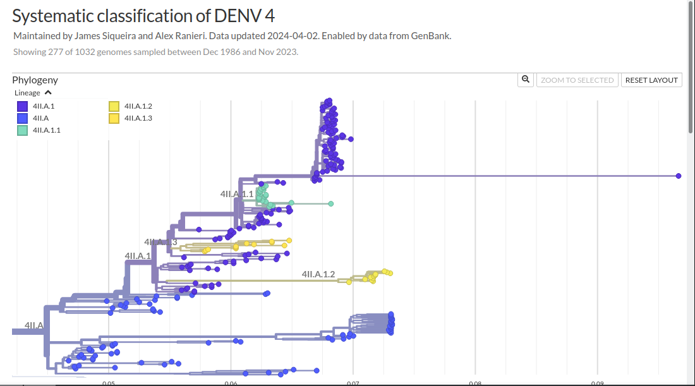

# Guideline for Proposing New Dengue Virus Lineages

This guide has been prepared to assist researchers and users of the [DyDEVILS](https://github.com/V-GEN-Lab/DyDEVILS/) classification system. It is especially useful for those who encounter clusters of sequences that, meeting the pre-established parameters outlined below, can be designated as new lineages.

- A grouping of at least 10 samples.
- The branch must contain at least one amino acid mutation.
- Bootstrap or UFBoot value (confidence) equal to or greater than 90.
- The identified mutation must cover at least 90% of the samples in the branch and isolate it from the rest of the tree.
- Only nodes with a GRI value greater than 1 will be considered.

## Step 1: Identifying a Potential New Lineage

For the preparation of this guide, a set of fictional sequences was generated through random induction of mutations in a phylogenetic tree sequence, simulating evolutionary diversification events. The corresponding [file](files/fictional-sequences.fasta) can be downloaded for users to proceed with the proposed analyses, allowing verification and validation of the methods presented.

### 1.1: Identification of the Target Group

- Ensure the sequence group contains at least 10 samples in the NextClade genrated tree (use the tree tab of web version or visualize the "nextclade.auspice.json" file generated by the local version using the --output-tree option).


<br>

- Download the "nextclade.auspice.json" file from the "export" tab of the web version of Nextclade or locate it among the files generated by the local version of the application.


<br>

### 1.2: Annotation with Autolin

- Execute the [Autolin](https://github.com/jmcbroome/automated-lineage-json/blob/9f33f12c1d2a73472b0aa85c4c5fcebb77a8aba6/annotate_json.py#L4) (original version) script with the following command:

``` 
python annotate_json.py -i nextclade.auspice.json -o nextclade.auspice_annotated.json -m -f 1 -s 10 -d 1 -c 90
```

- **-m**: Considers only mutations that alter amino acids.
- **-f**: Considers only nodes with a GRI value greater than 1.
- **-s**: Sets a minimum of 10 samples to annotate a lineage.
- **-d**: Sets the presence of at least one mutation compared to the ancestral annotation.
- **-c**: Sets that 90% of the samples must be annotated at each level.

#### Alternative: Using the Web Version of Autolin

An alternative is to use the [web version of Autolin](https://jmcbroome-automated-lineage-json-streamlit-app-3adskh.streamlit.app/) with the parameters above, as demonstrated below:


<br>

### 1.3: Annotation Verification

After annotation by Autolin, check if a new label has been assigned to the branch where the target sequences were inserted. If annotation is successful, this indicates that most of the pre-established parameters for proposing a lineage are present in this branch.

Example of an annotation made by Autolin on a group of fictional sequences inserted into the trees:


<br>

- Use the "Click + Shift" key combination on the branch containing the annotation to view the information associated with the annotated branch:


<br>

The user should monitor the presence of homoplasic and unique mutations. Homoplasic mutations have a reduced ability to isolate the branch from the rest of the tree; however, when associated with inherited mutations, they can enable isolation, especially when involving two or more mutations. On the other hand, unique mutations are capable of efficiently isolating lineages.

## Step 2: Phylogenetic Analysis to Retrieve UFboot Values

After the initial identification step, if the target branch displays the necessary characteristics for lineage designation, it is highly recommended to perform a phylogenetic reconstruction to retrieve UFBoot values associated with parental branch relationships.

### 2.1: Identification of the Ancestral Branch

Given that running the phylogenetic tree with all samples requires significant computational capacity, which may not be accessible to most users, we recommend that the analysis be conducted exclusively with the sequences that make up the immediately preceding lineage.

Considering that, in the previous example, the fictional sequences were assigned to subgenotype 4II.A, the analysis was performed exclusively with the sequences that make up this subgenotype:



<br>

### 2.2: Extraction of Sequence Identifiers

- Download the "nextclade.nwk" file from the web version of NextClade or locate it among the files generated by the local execution of the tool (using the --output-tree-nwk option).

- Use FigTree to select all Taxa from the annotated ancestral branch (4II.A) and copy the list with the sequence identifiers, which should be downloaded from the database (for DENV-1, 2 and 3, use GISAID EpiArbo; for DENV-4 use GenBank):


### 2.3: Phylogenetic Reconstruction

- Perform phylogenetic reconstruction using the [execPhyloDenv.sh](scripts/execPhyloDenv.sh) script with the original branch sequences in combination with the target sequences (note that the script activates a conda environment containing augur v24.1.0 in line 72, modify it to your execution environment needs).

### 2.4: Annotation of the Generated Tree with Autolin

- Execute the [customized Autolin script](https://github.com/V-GEN-Lab/DyDEVILS/blob/main/scripts/annotate_json_custom.py) with the same parameters:

``` 
python annotate_json.py -i nextclade.auspice.json -o nextclade.auspice_annotated.json -m -f 1 -s 10 -d 1 -c 90
```

### 2.5: Verification of the Final Annotation

- Check if an annotation has been made on the branch previously identified as a possible new lineage.


<br>

- If the annotation is present, check the amino acid mutations assigned to evaluate their ability to isolate the branch.


<br>

- With these steps, you should be able to identify and gather evidence to designate a possible new lineage of the dengue virus according to the established criteria.

## Step 3: Classification System Update
After identifying a possible new circulating lineage of the dengue virus, we request that the user create an "issue" on [DyDEVILS GitHub page](https://github.com/V-GEN-Lab/DyDEVILS/issues), providing the following information gathered during the lineage verification process:

- Identifier of the genomic sequences used (GenBank or GISAID EpiArbo).
- Highlight collection date and isolation location.
- Identification of the ancestral annotation to the lineage to be established; in the example cited, it would be the information 4II.A.
- Amino acid mutations found in the branch.

The classifier will be updated regularly, the frequency of which will be determined, ensuring its representativeness for the currently circulating lineages.
